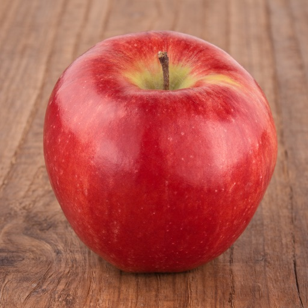

# Qwen-Image-2.1 Inference Engine (Rust)

A from-scratch Rust inference engine for [Qwen-Image-2.1](https://huggingface.co/Qwen/Qwen-Image-2.1), built directly on `candle-core` / `candle-nn`. It runs the official full-precision weights or GGUF quantized weights, on CUDA, Metal, or CPU, for both **text-to-image** and **image-conditioned generation** (editing / reference images).

Each stage (preprocessing, vision tower, text encoder, VAE, transformer, and the full denoising loop) has been checked numerically against the upstream diffusers pipeline and matches to ~1e-5.

## Features

- **Single-stream MMDiT transformer**: 32 blocks, 32 heads × 128, with the checkpoint's `causal_condition` (text tokens use a t=0 modulation row, image tokens the real timestep's row).
- **Official Qwen3-VL text encoder**: language model plus vision tower (for condition images, with multimodal RoPE and DeepStack); prompt wrapped in the upstream template, last decoder state taken before the final norm, system-prefix tokens dropped.
- **Two transformer backends**:
  - official diffusers safetensors (sharded, F32 or BF16 compute)
  - GGUF quantized weights, including ComfyUI-style GGUFs such as [`unsloth/Qwen-Image-2.1-GGUF`](https://huggingface.co/unsloth/Qwen-Image-2.1-GGUF) (Q8_0 and Q4_K_M tested)
- **Prefix KV cache**: the per-layer K/V of the text and condition-image tokens are computed once and reused across denoising steps (on by default, as upstream).
- **FlowMatch Euler scheduler** with the checkpoint's resolution-dependent exponential shift and `shift_terminal`.
- **VAE**: `AutoencoderKLQwenImage21` decoder and encoder, 64-channel latents, 16× spatial compression, RGBA (output saved as RGB). The decoder loads both the official diffusers layout and the ComfyUI-repackaged layout; the encoder needs the official one.
- **Image-conditioned generation** (`--image`, repeatable): the condition image is read by the Qwen3-VL vision tower as part of the prompt and VAE-encoded into latent tokens placed in the prompt's image slots, as in upstream `QwenImage21Pipeline`. Works for edits ("change the apple to a green apple"), style changes ("turn this photo into a watercolor painting"), object replacement, and composing several references into one image (see [Multi-reference example](#multi-reference-example)).
- **Optional true CFG** (`--negative-prompt` + `--true-cfg-scale`), off by default like upstream, since 2.1 is meant to be sampled without guidance.

## Getting the weights

From the official repo [`Qwen/Qwen-Image-2.1`](https://huggingface.co/Qwen/Qwen-Image-2.1) you need `text_encoder/`, `processor/` (tokenizer), `vae/`, and, for full precision, `transformer/`:

```bash
hf download Qwen/Qwen-Image-2.1 --local-dir models/Qwen-Image-2.1-official
```

For the quantized path, add a GGUF transformer:

```bash
hf download unsloth/Qwen-Image-2.1-GGUF qwen-image-2.1-Q4_K_M.gguf --local-dir models
```

The GGUF replaces only the transformer; the text encoder and VAE still come from the official repo.

## Build

```bash
cargo build --release --features cuda    # Linux + NVIDIA
cargo build --release --features metal   # macOS / Apple Silicon
cargo build --release                    # CPU only
```

At runtime the binary tries CUDA, then Metal, then falls back to CPU.

Optional FlashAttention v2 (NVIDIA sm80+, e.g. A100 / RTX 30xx / L20 and newer), used with `--flash-attn`. It compiles the flash-attn CUDA kernels with `nvcc` (9 minutes on a 44-core machine):

```bash
PATH=/usr/local/cuda/bin:$PATH CUDA_COMPUTE_CAP=89 cargo build --release --features flash-attn
```

## Usage

Quantized (GGUF) transformer:

```bash
R=models/Qwen-Image-2.1-official
./target/release/qwen3-image21 \
  --prompt "a red apple on a wooden table" \
  --model-path models/qwen-image-2.1-Q4_K_M.gguf \
  --vae-path $R/vae/diffusion_pytorch_model.safetensors \
  --text-encoder-path $R/text_encoder \
  --height 1024 --width 1024 --steps 20 \
  --output apple.png
```

Full precision: point `--model-path` at the first transformer shard. The remaining shards are found through the `*.safetensors.index.json` next to it.

```bash
  --model-path $R/transformer/diffusion_pytorch_model-00001-of-00002.safetensors
```

Image-conditioned generation (editing): pass one or more `--image`. The output size defaults to the last condition image's aspect ratio at `--output-resolution` (1024² area):

```bash
./target/release/qwen3-image21 \
  --prompt "Change the apple to a green apple" \
  --image apple.png \
  --model-path models/qwen-image-2.1-Q4_K_M.gguf \
  --vae-path $R/vae/diffusion_pytorch_model.safetensors \
  --text-encoder-path $R/text_encoder \
  --steps 20 --output green_apple.png
```

With several references, repeat `--image`; the prompt can refer to them as "image 1", "image 2", … in the order given (upstream labels them `<image1>`, `<image2>`, … in the prompt template). `--width`/`--height` can differ from the references' size and aspect ratio.

Don't edit an image with the seed it was generated from: identical starting noise locks the edit onto the original and produces an oversaturated copy. The default random seed avoids this.

With classifier-free guidance (roughly doubles the denoising time):

```bash
  --negative-prompt "blurry, low quality" --true-cfg-scale 4
```

### Multi-reference example

Two 1024×1024 references combined into a 768×1024 poster with Chinese calligraphy lettering (Q4_K_M + `--precision bf16`, 20 steps, 61 s denoising, 19.2 GiB peak GPU memory):

| Reference 1 | Reference 2 | Result |
|---|---|---|
|  |  |  |

```bash
./target/release/qwen3-image21 \
  --prompt '参考图1中的青花瓷茶杯和图2中的红苹果，设计一张秋日下午茶宣传海报。画面中央是图1的青花瓷茶杯和图2的红苹果，摆放在温暖的木桌上，周围点缀几片金黄的枫叶，背景柔和温暖。海报顶部用大号中文书法艺术字写"秋日茶语"，底部用优雅的中文字体写"一杯清茶 一份甜蜜"。' \
  --image teacup.png --image apple.png \
  --width 768 --height 1024 --steps 20 --seed 14065671437376715125 \
  --model-path models/qwen-image-2.1-Q4_K_M.gguf --precision bf16 \
  --vae-path $R/vae/diffusion_pytorch_model.safetensors \
  --text-encoder-path $R/text_encoder \
  --output poster.png
```

The teacup keeps reference 1's blue floral pattern, gold rim, and saucer; the apple matches reference 2; both lines of Chinese text render without errors. Each 1024² reference adds 1,024 image tokens to the prompt (2,165 prompt tokens here) and 4,096 latent tokens to the transformer, so this run's sequence is 117 text + 8,192 reference + 3,072 target ≈ 11,400 tokens, and its prefix KV cache is ~4.4 GB (stored in BF16). `--precision bf16` puts the text encoder in BF16; the GGUF transformer still computes in F32.

### Options

| Option | Default | Notes |
|---|---|---|
| `--prompt` | (required) | |
| `--output` | `output.png` | |
| `--height`, `--width` | `1024` | Multiples of 16 (one latent cell = 16×16 px). With `--image`, default to the condition image's size. |
| `--image` | | Condition image (repeatable). Needs the official text encoder (it contains the vision tower). |
| `--output-resolution` | `1024` | Condition images are resized to about this² pixels at their own aspect ratio (multiples of 32). |
| `--steps` | `40` | Upstream default. 20 already gives clean results. |
| `--model-path` | (required) | `.gguf` → quantized path; otherwise safetensors. |
| `--vae-path` | | |
| `--text-encoder-path` | | The official `text_encoder/` directory (a dense Qwen3 stand-in also loads, but gives semantically wrong conditioning). Omitting it uses random embeddings. |
| `--negative-prompt` | | Only used when `--true-cfg-scale > 1`. |
| `--true-cfg-scale` | `1.0` (off) | `neg + scale × (cond − neg)`, no rescaling, as upstream. |
| `--no-kv-cache` | off | Recompute the text prefix every step (for A/B checks). |
| `--precision` | `f32` | `bf16` halves the memory of the full-precision transformer and of the text encoder's streamed layers (see [Memory](#memory)). GGUF transformers and the VAE always compute in F32. `f16` is untested. |
| `--text-encoder-cpu` | off | Run the text encoder and vision tower on the CPU in F32. Rarely needed: on a GPU the encoder is streamed layer by layer (~6 GiB peak); the CPU adds ~75 s of prompt encoding. |
| `--flash-attn` | off | FlashAttention v2 for the unmasked attention of every step after the first (with the KV cache); the first step's block-causal mask still takes the chunked path. Needs a `--features flash-attn` build. F32 inputs are cast to F16 for the kernel. |
| `--tf32` | off | Allow TF32 tensor cores for F32 matmuls on CUDA: full-precision F32 denoising 84 → 60 s at ~2e-4 relative error (BF16 is ~9e-3). No effect on GGUF linear layers or BF16. |
| `--benchmark`, `--benchmark-iterations` | off, `3` | Keeps transformer + VAE loaded and times repeated runs. |
| `--seed` | random | Printed at startup; pass it again to reproduce a run. Noise is drawn on the host, so a seed gives the same noise on every device. |
| `--quantized` | | **Currently ignored**; the backend is chosen by the `--model-path` extension. |

## Performance

NVIDIA L20 (46 GB), 1024×1024, 20 steps, denoising time only:

| Transformer | Size on disk | KV cache on | KV cache off |
|---|---|---|---|
| Full precision (F32 compute) | 14 GB (BF16) | 63.2 s | 70.0 s |
| Q8_0 GGUF | 7.6 GB | 29.8 s | 38.1 s |
| Q4_K_M GGUF | 4.2 GB | 30.0 s | 38.2 s |

- Q4_K_M and Q8_0 run at the same speed: both go through candle's MMQ kernels (activations quantized to q8_1, integer dot products), whose cost here is dominated by other work, so fewer bits mainly save disk and memory.
- The KV-cache gain comes mostly from dropping the per-layer block-causal attention mask on cached steps, not from skipping the ~15 text tokens.
- Attention uses candle's fused last-dim softmax. The generic `softmax` (five full passes over the score matrix) took over half of all GPU kernel time in an `nsys` profile; switching roughly halved denoising time for the quantized paths. LayerNorm, the Q/K RMSNorm, and RoPE also use candle's fused kernels (a further 8–17%): the LayerNorms carry a zero bias because candle only takes its fused path when a bias is present, and the Q/K norms run before the head transpose because the fused RMSNorm needs a contiguous input.
- Accuracy vs. full precision (one forward pass, cosine similarity): Q8_0 0.99986, Q4_K_M 0.99537. Neither shows a visible quality difference.

Image-conditioned generation at 1024×1024 (one 1024² condition image, 20 steps) roughly doubles the sequence to ~8,200 tokens. Denoising time:

| Transformer | Default | `--flash-attn` |
|---|---|---|
| Full, F32 | 74 s | 53 s |
| Full, F32 + `--tf32` | 56 s | 36 s |
| Full, `--precision bf16` | 52 s | 24 s |
| Q4_K_M (+ `--precision bf16` text encoder) | 45 s | 24 s |
| Q4_K_M, two 1024² references, 768×1024 output (~11,400 tokens) | 57 s | 28 s |

This table predates the prefix-only cache fill (see [Memory](#memory)), which trimmed a further 1–5 s: with it, Q4_K_M `--flash-attn` takes 21 s, full BF16 `--flash-attn` 20 s, full F32 71 s, and the two-reference case 23 s.

Without flash attention, attention is computed in query chunks sized so each score block stays near 256 MB, so the score matrix never has to fit at once. Flash attention accuracy vs. the golden tensors (cached step): F32 mean relative error 4.3e-4 (4.1e-4 without it; both dominated by the BF16 KV cache), BF16 7.5e-3 (8.3e-3 without). Output images differ from the non-flash runs by a mean 0.02 (F32) to 0.4 (Q4_K_M) on a 0–255 scale; the two-reference poster differs by 4.9 — same composition and lettering, with small drift in fine detail (leaf edges, brush strokes) accumulated over the 20 steps.

### Memory

Models are loaded in phases (text encoder → VAE encoder for condition images → transformer → VAE decoder), each dropped before the next, and the device is synchronized after each phase so CUDA's stream-ordered allocator actually returns the freed memory. Within the phases:

- **Text encoder**: on a GPU its 36 language-model layers are streamed in one at a time from the memory-mapped checkpoint, with the embedding table kept in host memory: bit-identical output, same encoding time, ~6 GiB peak in F32 (~4.4 in BF16) instead of ~34 / ~17 GB of resident weights.
- **Transformer**: the prefix KV cache is filled by a pass over the prefix (text + condition images) alone, which never attends to the target, so the full joint sequence is never materialised; every step, the first included, then runs only the target tokens.
- **VAE**: the decoder's up-blocks run in row bands with a 7-row halo (exact, since everything after the mid-block is spatially local), and its 3×3 convolutions bound candle's im2col buffer.

Peak GPU memory (sampled with `nvidia-smi` every 100 ms), 1024² image-conditioned edit with one 1024² condition image, 20 steps, L20:

| Configuration | Peak (GiB) | Text encoding | Denoising | Wall |
|---|---|---|---|---|
| Q4_K_M + `--flash-attn` | **8.7** | 6 s | 21 s | 33 s |
| Q4_K_M + `--precision bf16` (no flash attention) | 9.2 | 5 s | 48 s | 58 s |
| Full, `--precision bf16` + `--flash-attn` | 17.6 | 5 s | 20 s | 32 s |
| Full, F32 (default) | 32.7 | 6 s | 78 s | 91 s |
| Q4_K_M + `--flash-attn`, two 1024² references, 768×1024 output | 11.9 | 7 s | 24 s | 36 s |
| Same, with `--output-resolution 768` (references at 768²) | **9.3** | 5 s | 17 s | 27 s |

- **For a 12 GB GPU**: Q4_K_M with `--flash-attn`. That covers text-to-image and single-reference edits at 1024²; for two references add `--output-resolution 768`, since two 1024² references (11.9 GiB) exceed a 12 GB card's usable ~11.2 GiB. Without flash attention (older GPUs, or builds without `--features flash-attn`) a single-reference edit peaks at 9.2 GiB. The text encoder needs neither BF16 nor the CPU to fit; `--text-encoder-cpu` is only a fallback.
- The peak is the transformer phase: Q4_K_M weights (~4.2 GB), the prefix KV cache (~2.2 GB per 1024² reference, stored in BF16), and activations. Attention score blocks (~256 MB per query chunk) and MLP intermediates (2,048 tokens at a time) are bounded; the smaller attention chunks cost ~10–15% of denoising time without flash attention.
- The prefix KV cache is always stored in BF16 (cast back to the compute dtype when attended to): for the two-reference poster above it is ~4.4 GB instead of ~8.7 GB, lowering that run's peak from 26.2 to 20.1 GiB at the time. Cached vs. uncached step (`kv_cache_probe`, 512²): cosine 0.999997 for full precision, 0.9997 for Q4_K_M; the poster rendered with the same seed differs from the F32-cache version by a mean 1.4/255, with no visible difference.
- BF16 accuracy vs. the F32 golden tensors (cosine): transformer 0.99996, text encoder 0.995, vision tower 0.996. The latents stay F32 across denoising steps and attention softmax runs in F32. In the runs above the output images differ from the F32 run by a mean 0.3 (BF16) and 1.3–1.4 (Q4_K_M) on a 0–255 scale, with no visible difference.

## Project layout

```
src/
├── main.rs                  # CLI, phased model loading, image saving
├── pipeline.rs              # denoising loop (CFG, KV cache), latent decoding
├── transformer.rs           # full-precision transformer, TextKvCache
├── quantized_transformer.rs # GGUF transformer (same math, quantized matmuls)
├── text_encoder.rs          # prompt templates (text / with images) + encoder backends
├── qwen3_vl_text.rs         # Qwen3-VL language model (multimodal RoPE, DeepStack, pre-norm states)
├── qwen3_vl_vision.rs       # Qwen3-VL vision tower (vendored from candle-transformers)
├── condition_image.rs       # condition-image resize + VAE/vision preprocessing
├── joint_layout.rs          # transformer sequence: text, condition-image blocks, target
├── rope.rs                  # 3-axis (frame/height/width) RoPE
├── attention_mask.rs        # block-causal mask (causal text, bidirectional image)
├── scheduler.rs             # FlowMatch Euler + sinusoidal timestep embedding
├── vae.rs                   # AutoencoderKLQwenImage21 encoder + decoder
└── bin/                     # diagnostics (see below)
```

## Diagnostics

The `src/bin/` tools were used to find and verify the fixes that made this engine match the reference:

| Binary | Checks |
|---|---|
| `tensor_coverage_probe` | Every checkpoint tensor is consumed by the model code (no silently dropped weights). |
| `gguf_weight_probe` | Dequantized GGUF tensors match the official safetensors. |
| `quant_vs_full_probe` | One forward pass: full precision vs. quantized on GPU vs. quantized on CPU. |
| `kv_cache_probe` | Cached and uncached forwards agree. |
| `i2i_probe` | Each stage of image-conditioned generation (`vae`, `pre`, `vision`, `text`, `transformer`, `encode`, `loop`) against golden tensors from `tools/ref_dump_i2i.py`, which runs the upstream diffusers pipeline (needs torch + diffusers main + transformers). |
| `text_conditioning_probe` | Different prompts change the transformer's prediction. |
| `real_latent_probe`, `vae_probe`, `synth_latents` | Decode real or synthetic latents directly through the VAE. |

```bash
cargo test    # unit tests (RoPE vs. reference formula, dup_up3d, scheduler, attention mask, …)
```

## Limitations

- `--quantized` is redundant (the backend is chosen by the `--model-path` extension).
- Condition images are resized with the `image` crate's Lanczos3, close to but not bit-identical with upstream's PIL resize.
- `--precision bf16` has been verified (see [Memory](#memory)); `f16` is untested.
- End-to-end quality has been verified on CUDA only. The CPU path was checked at the single-forward level (quantized on CPU matches full precision); Metal has not been re-verified since the correctness fixes.
- Flash attention is opt-in and CUDA-only; the prefix pass that fills the KV cache (block-causal mask) always uses the chunked path, which materialises scores one ~256 MB chunk at a time.

## License

MIT
